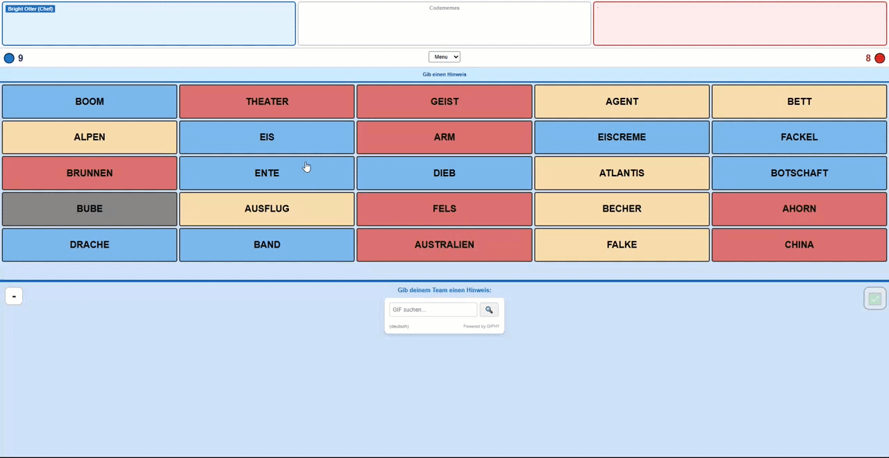

# Codememes

## [im Browser öffnen →](https://codenames-adgg.onrender.com/#/)

  

 

## Funktionen

* **Codememes:** Wie "Codenames", nur mit Memes als Hinweise.
* **Multiplayer:** Spiele Runden mit deinen Freunden in privaten Lobbys.
* **--:** .
* **--:** .
  
  ---

## Feedback

[Fehler melden](https://github.com/schwanniii/Codememes/issues) - [Feature vorschlagen](https://github.com/schwanniii/Codememes/issues)

